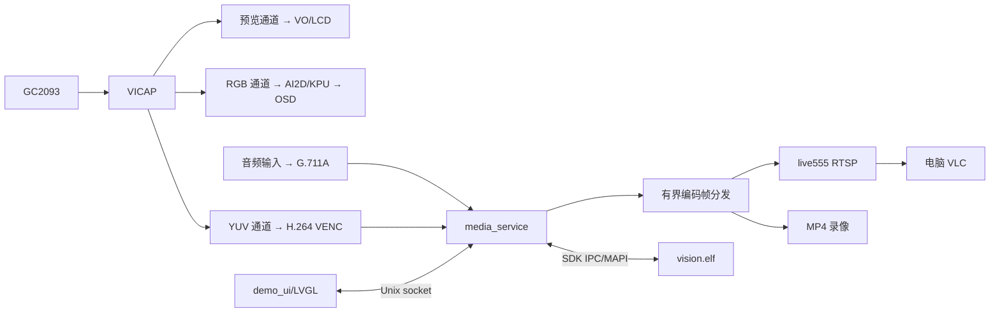

# lawrec 项目开发方案

更新日期：2026-10-03。

## 1. 目标和约束

重新实现一个运行在庐山派 K230 上的边缘视觉 Demo，包含以下技术链路：

- K230 Linux/RT-Smart 协作。
- GC2093 → VICAP → VO/VENC 的 Camera Pipeline。
- AI2D、nncase/KPU、MobileRetinaFace 人脸检测和 OSD。
- H.264、G.711A、live555 RTSP 和 MP4 录像。
- LVGL 触控界面、进程间通信和基本性能测量。

代码以“少而清楚、能编译、能形成完整闭环”为目标。不要继续把旧工程发展成产品级代码库。

必须遵守：

1. 第 2 节列出的功能均属于本项目目标，按第 9 节的依赖顺序实现，并按第 10 节统一验收。
2. 当前只离线开发。开发期间不连接开发板；完成全部代码、构建和离线检查后，再进行一次整体上板验收，并根据结果修正。
3. 显示、MIPI 时钟、PHY、ST7701 和触控适配已经完成。复用用户确认通过的版本，不再修改触摸驱动、寄存器、时序或增加触控诊断入口。
4. 允许按职责使用多个进程，但进程数量应少、边界应清楚。不能为了“解耦”复制初始化、协议和状态机，也不能为了“简单”把所有功能堆进一个超大进程。
5. 从开发开始维护 Git 仓库和开发日志。每个可解释的开发任务都要有对应提交、验证记录和剩余问题。

离线完成和硬件验收通过是两个状态。没有实板时只能标记为“已编译”或“已完成离线检查”，不能声称摄像头出帧、KPU、图层组合、音视频同步或真实帧率已经通过。

## 2. 完整功能范围

| 模块 | 目标 |
| --- | --- |
| 摄像头/显示 | GC2093 采集、VICAP、VO、LCD 预览；复用已适配的屏幕和触控 |
| AI | MobileRetinaFace 单模型，AI2D resize/padding、KPU 推理、解码、阈值过滤、NMS、坐标映射 |
| OSD | LCD 上显示人脸框、关键点、检测数量；OSD 与 LVGL 图层不冲突 |
| 视频 | H.264，1280×720，固定输入/输出帧率和码率 |
| 音频 | 使用 SDK 已适配的输入，编码为 G.711A，核对采样率、声道和 PTS |
| RTSP | live555，固定 `rtsp://<board-ip>:8554/lawrec` |
| 录像 | 从同一编码源写入 10～20 秒 MP4，电脑可播放 |
| UI | 一个主页面：预览、AI、RTSP、录像开关，以及状态和耗时 |
| 并行 | 预览、AI、RTSP、录像可以同时运行；分别停止一路不误停其他消费者 |
| 指标 | AI 各阶段耗时、处理帧率、码率、队列长度、CPU/RSS/VB 预算 |

不开发 WiFi/DHCP/ARP 管理、人脸库和身份识别、EIS/全景/AVM、复杂设置页、云端服务、自动故障恢复、长时间压力平台、板端播放器和文件管理器。网络使用已经配置好的连接。

## 3. 架构原则和进程划分

推荐三个程序，但允许根据 SDK 约束合并或拆分：

| 程序 | 系统 | 主要职责 |
| --- | --- | --- |
| `vision.elf` | RT-Smart | VB、GC2093、VICAP、VO、AI、OSD，以及面向 Linux 的业务 IPC |
| `media_service` | Linux | VENC/AENC 控制、编码帧分发、live555、MP4、媒体状态 |
| `demo_ui` | Linux | LVGL、现有触控输入、页面绘制、操作反馈 |

推荐这样拆分的原因是 UI 与媒体可以独立编译和开发，RTSP 与录像又能共享一个编码帧源。它不是必须的产品服务架构：

- 若 SDK 只能由一个应用持有 MAPI 资源，可以把 `media_service` 合并进 UI 进程，但仍保持 `ui`、`media`、`ipc` 模块边界。
- 若某功能确实需要独立重启，可以拆进程；必须说明新增 IPC 和资源管理的收益。
- 禁止为了拆分而复制摄像头/VB/显示初始化，也禁止多个进程竞争同一资源。



资源归属必须唯一：摄像头/VB/VICAP/VO/AI/OSD 归 `vision.elf`；编码控制、编码帧队列、RTSP、录像归 `media_service`；LVGL 和触控读取归 `demo_ui`。UI 不得重新初始化连接器或复位面板。

## 4. Camera、AI 和显示实现

候选通道为：CHN0 800×480 YUV 预览，CHN1 1280×720 planar RGB 给 AI，CHN2 1280×720 YUV 给 VENC。实际通道号、stride、格式、buffer 数量和 VB 大小必须根据本地 SDK 头文件、官方示例和已有适配代码核查后集中配置。

旧代码中 LCKFB 的 AI 与 CHN1 编码存在格式冲突，CHN2 曾被关闭。重新实现时必须解决 RGB→AI、YUV→VENC、预览→VO 的并行关系；不能只改一个宏就宣称完成。若 SDK 证据表明候选通道不支持，记录依据并调整方案，不实现多套自动回退 Pipeline。

AI 主链固定为：

```text
RGB 帧 → AI2D resize/padding → nncase/KPU → 输出解码
      → 置信度过滤/NMS → 坐标和旋转映射 → OSD → 释放帧
```

- 只加载 `retinaface.kmodel`，不加载 `mbface.kmodel` 和人脸库。
- 模型初始化一次。AI 关闭时停止取帧推理并清除 OSD，不反复加载模型。
- 分别统计 AI2D、KPU、后处理和总耗时；帧处理不过来时丢弃旧帧或固定间隔推理，不引入跟踪器。
- 核对颜色顺序、planar/NCHW、归一化、padding、模型输入尺寸和输出解码参数。
- OSD 只要求本地 LCD 显示。检测框不要求烧录进 RTSP/MP4，除非实际 Pipeline 明确支持。

## 5. 媒体和并行实现

固定使用 H.264、1280×720、30 FPS 输入，输出帧率和码率使用 SDK 支持的演示值，例如 30 FPS、4 Mbps。音频使用已经适配的 SDK 输入和 G.711A，不凭接口名称猜采样率或 PTS 单位。

`media_service` 只申请一套编码源，编码回调把 SDK 临时数据复制到自有的不可变帧对象，再分别投递到 RTSP 和录像两个有界队列：

- 两个消费者不能互相竞争同一个队列；同一编码帧可以被两个消费者引用。
- 回调只复制和分发，不在回调里写文件或执行网络发送；不宣称零拷贝。
- 队列按帧数和字节数限制。RTSP 从 SPS/PPS、IDR 等可解码边界开始；拥塞时按完整帧/GOP 处理并请求 IDR。
- 录像正确处理音视频 PTS、MP4 收尾、写入和关闭错误；不承诺断电恢复。
- 第一个消费者启动编码源，最后一个消费者停止编码源。停止 RTSP 不得销毁仍被录像使用的资源，反之亦然。
- SDK stop/unregister 等可能等待回调的接口不能在回调锁内调用。

RTSP、录像和音频共享必要的编码参数，但不开发通用订阅平台、自动重连或多级恢复状态机。

## 6. 控制协议和 UI

UI 到 Linux 媒体后台使用本地 Unix socket；媒体后台到 RT-Smart 使用 SDK IPC。应用控制只传小消息，不自建跨核原始视频共享内存。

协议使用固定宽度整数和明确版本，不传指针、`std::string` 或依赖编译器布局的对象。保留以下操作：

```text
SET_PREVIEW(bool)
SET_AI(bool)
SET_RTSP(bool)
SET_RECORD(bool)
GET_STATUS
```

状态包含开关/忙碌/错误、检测数量、AI 各阶段耗时、处理帧率、编码统计和最后错误。重复设置当前状态直接返回，不重复初始化硬件。请求应有超时和可见错误，但不自动重试。

UI 主线程只绘图和处理触控；socket 通信放到简单工作线程或非阻塞事件中，按钮回调不能同步等待跨进程/跨核调用。只实现一个主页面和必要提示，不增加网络页、维护页和设置中心。

## 7. 代码组织和规模控制

建议创建独立的 `lawrec-demo` Git 仓库；旧 `lawrec` 只作为硬件适配和可用模块参考。若必须在旧仓库开发，使用专用分支或工作树，不覆盖用户已有未提交改动。

```text
lawrec-demo/
├── AGENTS.md                 # 本 Demo 的简洁开发约束
├── README.md
├── common/                   # 协议、配置、小工具
├── big/                      # vision：camera、detector、display、control
├── little/media/             # media_service：encoder、audio、rtsp、recorder
├── little/ui/                # demo_ui：LVGL 页面、输入、socket 客户端
├── tools/                    # Docker 构建、离线检查、打包和启动脚本
├── tests/                    # 少量纯逻辑、协议、队列、PTS 测试
├── patches/                  # 必要 SDK 适配补丁及来源
├── docs/plan.md
├── docs/devlog.md            # 唯一连续开发日志
├── docs/acceptance.md
└── out/                      # 构建输出，不入 Git
```

文件按真实职责拆分，不为每个函数创建类。`main` 只编排；新业务文件尽量不超过约 500 行，持续变大时按职责拆分。新增/重写的业务胶水以几千行（约 3,000～6,000 行，不含 SDK、LVGL、live555、模型和板级适配）为规模检查目标；明显超出时先检查是否把旧工程重新带回来了。

不要把 WiFi、DHCP、ARP、播放、网络恢复、复杂文件安全和旧产品服务重新接入编译清单。旧代码按模块提取，保留版权和来源，使用明确源文件清单，避免通配符编入整套旧业务。

## 8. Git 和开发日志要求

### Git

1. 开始前记录旧工程和 SDK 的当前分支、提交号、工作区状态；不清空、不覆盖、不强制重置用户现有修改。
2. 首次提交包含任务书、精简 `AGENTS.md`、`.gitignore`、构建骨架和 SDK 基线说明。
3. 每完成一个可解释的功能任务并通过对应离线检查，提交一次相关代码和日志。推荐序列：骨架 → Camera/AI → 编码/音频 → RTSP/MP4 → IPC/UI → 集成打包。
4. 提交前检查 diff，使用明确路径暂存；禁止用 `git add .` 把临时文件、旧改动、模型输出和 `out/` 一起提交。
5. 提交信息说明用途，例如 `feat: add camera and AI pipeline`、`feat: share encoded frames`、`fix: keep media timestamps`。未编译完成的实验标记为 WIP，不冒充完成点。
6. 不提交 SDK、工具链、Docker 镜像、构建目录、口令和临时日志；模型记录来源、版本和校验值。不得自动 push、force-push 或改写既有历史。

记录 `K230_SDK_ROOT`、SDK 提交/版本、Docker 镜像、`k230_canmv_lckfb_defconfig`、显示/触控/LVGL 适配版本和 SDK 补丁。最终应用包基于明确提交构建，记录提交号和校验值。

### 开发日志

维护唯一的 `docs/devlog.md`。每完成一个任务、改变架构决定或遇到关键问题更新一次，不为每次命令调用写日志，也不生成大量重复专项文档。每条记录包含：

```markdown
### YYYY-MM-DD：任务名称
- 修改：实际改动。
- 决定：关键选择及原因。
- 验证：实际 Docker 命令和结果。
- 未验证/风险：离线无法证明的内容。
- 下一步：下一项工作。
```

日志与代码同次提交；提交号由 Git 历史提供，不在提交前伪造自身 hash。详细输出放 `out/`，日志只保留结论、关键错误和路径。每次工作结束向用户报告完成内容、离线验证、提交号和剩余事项。

## 9. 离线开发、构建和测试

不连接开发板时按依赖顺序完成同一套完整功能：

1. 建立仓库、任务书、日志、Docker 构建入口和 SDK 基线。
2. 查阅 SDK 官方示例和头文件，确认 VICAP 三通道、VB、MAPI VENC/AENC、IPC、VO/OSD 的真实接口；完成 `vision.elf`、`media_service`、`demo_ui` 的交叉编译和链接。
3. 完成 AI2D、模型输入、后处理、坐标映射和 OSD；用固定数据测试 NMS、坐标旋转和协议结构。
4. 完成编码帧生命周期、音频、两个消费者队列、PTS、RTSP 和 MP4；用真实库和样例码流做离线检查。
5. 完成 Unix socket、SDK IPC、LVGL 页面和状态更新；用模拟后端验证命令和状态变化。
6. 统一从清晰 Git 提交重建，检查 ELF 架构、动态库、模型、启动脚本、应用包和校验清单。

所有 Docker 编译和测试使用 `K230_SDK_ROOT` 对应的 Docker 入口，禁止在宿主机直接调用交叉编译器。只写有价值的边界测试：协议长度、NMS/坐标、队列双消费者、PTS 换算、MP4 收尾和错误返回；不制作庞大的模拟硬件框架或追求覆盖率数字。

离线阶段不能证明传感器出帧、三通道实际并发、KPU 硬件执行、VO 图层、硬件音频、整机同步和真实性能。将其列入验收清单，继续完成可验证部分。

## 10. 交付物和最终上板验收

离线交付：

1. 完整 Git 仓库、提交历史、`docs/devlog.md` 和 `docs/acceptance.md`。
2. `vision.elf`、`media_service`、`demo_ui`、必要动态库和 `retinaface.kmodel` 部署说明。
3. Docker 构建入口、应用包、文件校验清单、启动/停止脚本和 VLC 命令。
4. README：架构、进程边界、IPC、录像路径、指标含义和已知限制。

离线开发完成后进行整体上板验收；如果发现问题，修正后再复验：

- 预览和已完成的触控操作正常；UI 不重新初始化屏幕。
- AI 能显示人脸框/关键点，开关 AI 不影响推流。
- VLC 能播放 H.264 + G.711A RTSP。
- 录像 10～20 秒，正常停止后电脑可以播放和听音频。
- 预览、AI、RTSP、录像短时间同时运行；分别停止 RTSP/录像时另一功能继续。
- 输出一组真实 AI 耗时、处理帧率、编码码率、CPU/RSS/VB 数据。

上板前不烧录、不安装、不修改板端网络。启动顺序为大核视觉程序 → Linux 媒体后台 → UI；停止顺序为 UI → 媒体后台（完成录像收尾）→ 大核。脚本只管理本次启动的进程，不使用宽泛 `killall`。验收结果和问题修正继续写入 Git 与开发日志。

## 11. 执行要求

先保存硬件基线，建立精简仓库、构建入口和日志，再按依赖实现完整功能。允许复用 SDK 示例和已验证代码，禁止重新实现底层库；保留必要错误检查、队列边界、帧生命周期和 MP4 收尾，但不构建通用框架、网络管理或复杂恢复系统。

每项工作完成离线检查、更新日志并提交 Git。全部离线开发完成后交付待上板包；中途不等待开发板，不声称硬件通过，也不擅自缩减第 2 节的功能范围。
